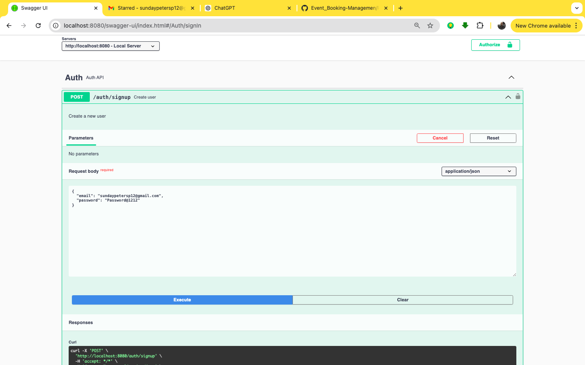
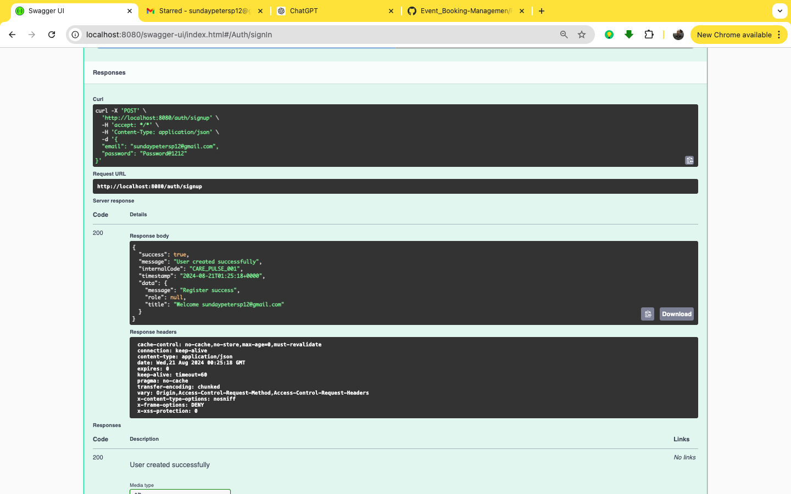
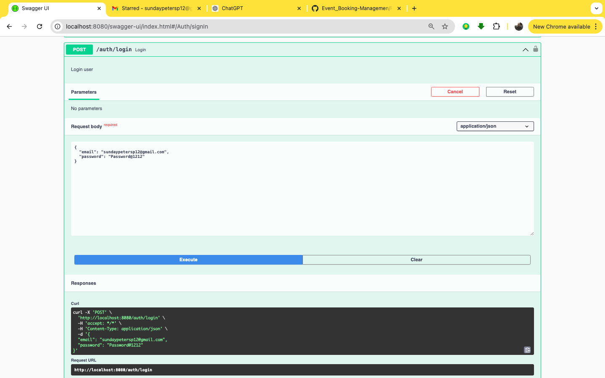
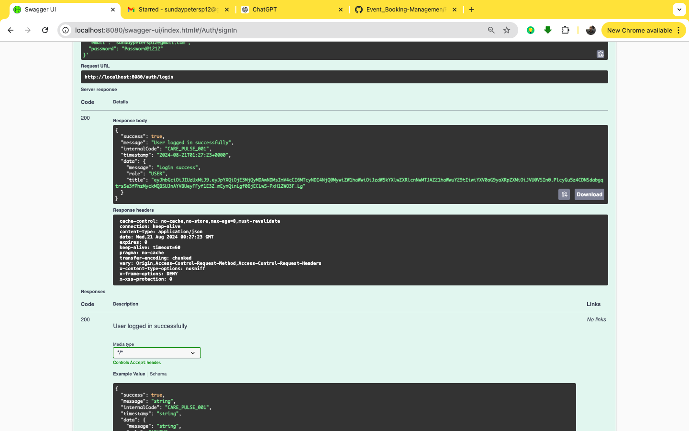
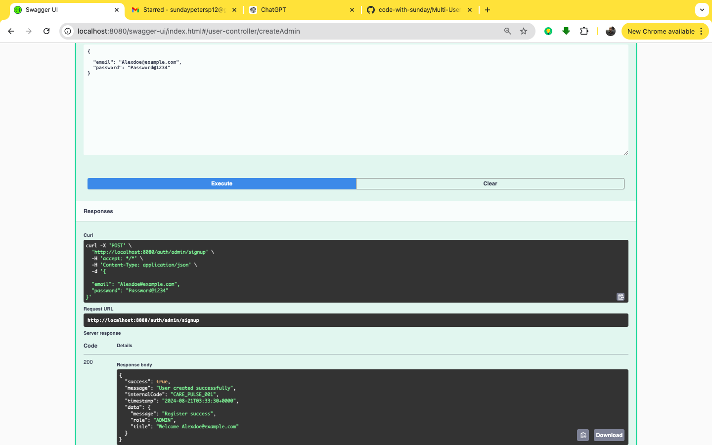
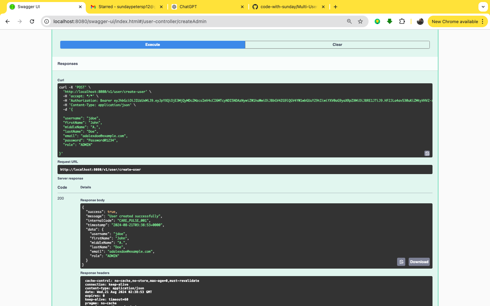
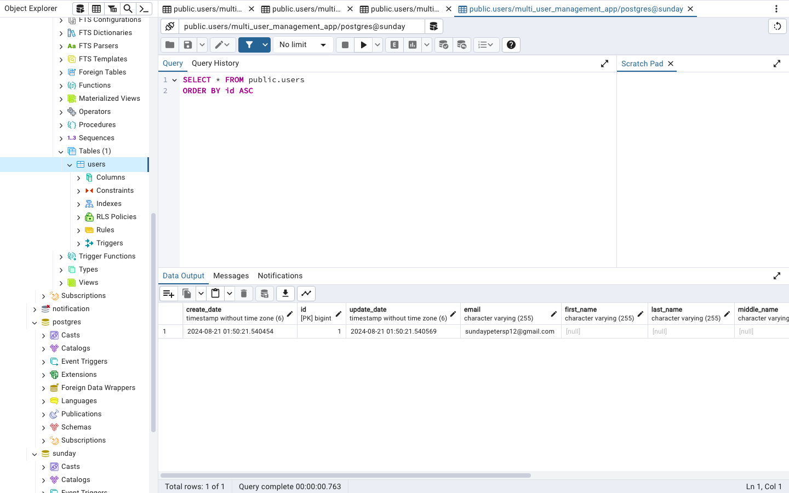
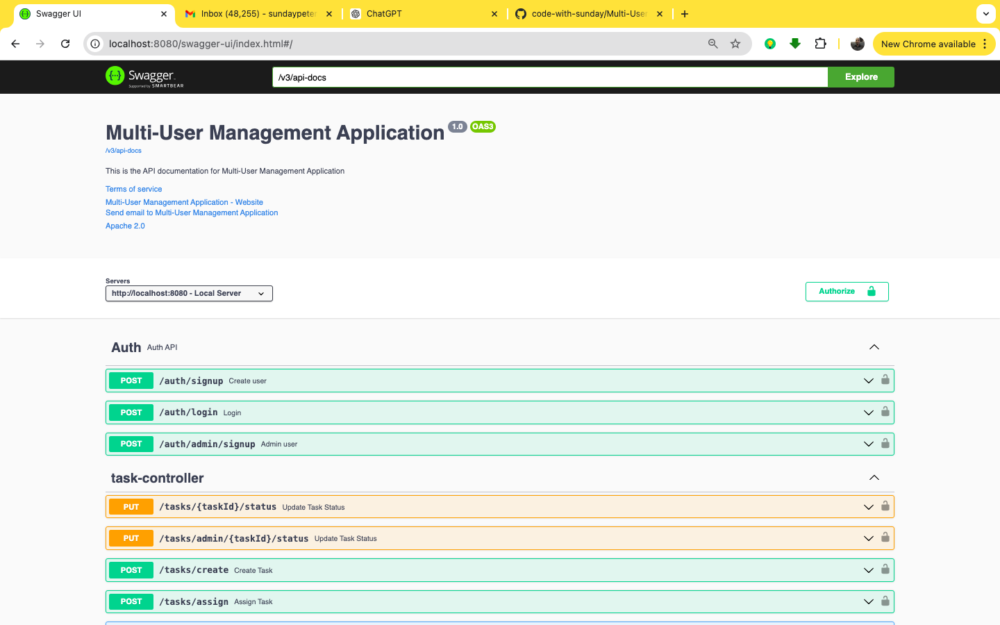
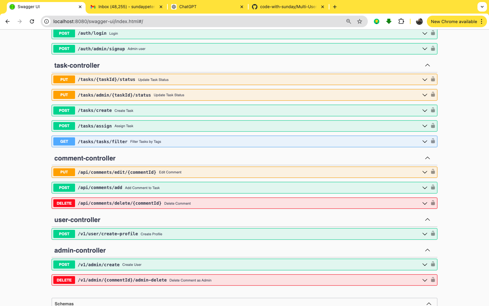

<!-- TABLE OF CONTENTS -->
<details>
  <summary>Table of Contents</summary>
  <ol>
    <li>
      <a href="#about-the-project">About The Project</a>
    <li>
      <a href="#about-the-project">Built With</a>
    <li>
      <a href="#about-the-project">Getting Started</a>
    <li>
      <a href="#about-the-project">Features/Usage</a>
    <li>
      <a href="#about-the-project">Sample Test</a>
    <li>
      <a href="#about-the-project">Sample Data Persisting DB</a>
    <li>
      <a href="#about-the-project">Contact</a>
  </ol>
</details>

<!-- ABOUT THE PROJECT -->
## About The Project


[![MULTI-USER-MANAGEMENT-APPLICATION][SWAGGER-ENDPOINT-VIEW]](image.png)

This project is a comprehensive Multi-User Task Management API designed to demonstrate backend development skills and proficiency. The API supports user management with role-based access control, allowing both regular users and admins to manage tasks efficiently. The project is built with the following key features:


### Built With

* Spring-Boot
* Spring Security
* Hibernate
* Spring Stater JPA
* Javax Mail and Javax Mail Activation
* Springdoc-Openapi
* Jason Web Toke(JWT)
* Lombok
* Spring-boot starter Validation
* Relational Database(Postgres)
* Spring-boot starter test


<p align="right">(<a href="#readme-top">back to top</a>)</p>

<!-- GETTING STARTED -->
## Getting Started

This is an example of how you may give instructions on setting up your project locally.
To get a local copy up and running follow these simple example steps.

### Prerequisites

This is a list of things you will need to use the software and how I got to work on this project
* Java 17
* Maven
* H2 database

### Installation

1. Clone the repo
   ```sh
   git clone https://github.com/code-with-sunday/Multi-User-Management-App.git
   ```
2. create db in local postgres to suit db name on application.properties
3. run application
3. use http://localhost:8080/swagger-ui/index.html#/ to test endpoint with swagger
   

<p align="right">(<a href="#readme-top">back to top</a>)</p>


<!-- USAGE EXAMPLES -->
## Features / Usage

- [ ] <span style="font-size: 20px; font-weight: bold;">User Registration / Sign-up : </span>
<span style="font-size: 20px; ">User's registers smartly with email and password</span>

  
  


- [ ] <span style="font-size: 20px; font-weight: bold;">User Login / JWT TOKEN : </span>
 <span style="font-size: 20px; ">On login exact role is authomatically determined and jwt token generated</span>

  
  

- [ ] <span style="font-size: 20px; font-weight: bold;">Admin creation and Admin creating admin</span>
  
  

  
<!-- DB -->
## Sample Data Persisting DB
<span style="font-size: 20px; font-weight: bold;">Persisting DB on login before full profile creation, showing password hashed and store to db</span>


<span style="font-size: 20px; font-weight: bold;">swagger complete api view</span>




<!-- CONTACT -->
## Contact
- [ ] <span style="font-size: 16px; font-weight: bold;">SUNDAY PETER</span>

- [ ] <span style="font-size: 16px; font-weight: bold;">[@linkedin](https://www.linkedin.com/in/sundaypeter1/)</span>

- [ ] <span style="font-size: 16px; font-weight: bold;">sundaypetersp12@gmail.com</span>

- [ ] <span style="font-size: 16px; font-weight: bold;">WhatsApp : 08186707807</span>

- [ ] <span style="font-size: 16px; font-weight: bold;">CALL : 08169036052</span>